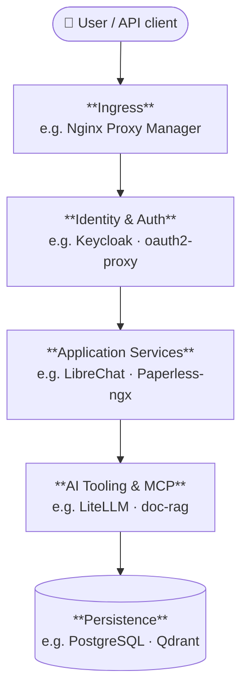

# Architecture — Big Picture

> **Status:** Complete · **Stack version:** 0.7.0

## Layer overview

| # | Layer | Responsibility |
|---|-------|----------------|
| 1 | **Ingress** | TLS termination, reverse proxy, certificate management |
| 2 | **Identity & Auth** | OIDC authentication, forward-auth for non-OIDC services |
| 3 | **Application Services** | End-user features: chat, document management, workflows, search, dashboard |
| 4 | **AI Tooling & MCP** | LLM routing, RAG pipelines, model inference, MCP tool endpoints |
| 5 | **Persistence** | Durable storage: relational databases, vector stores, message queues |
