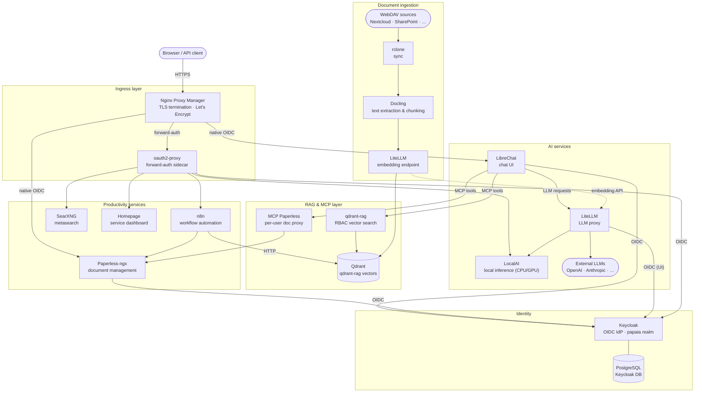
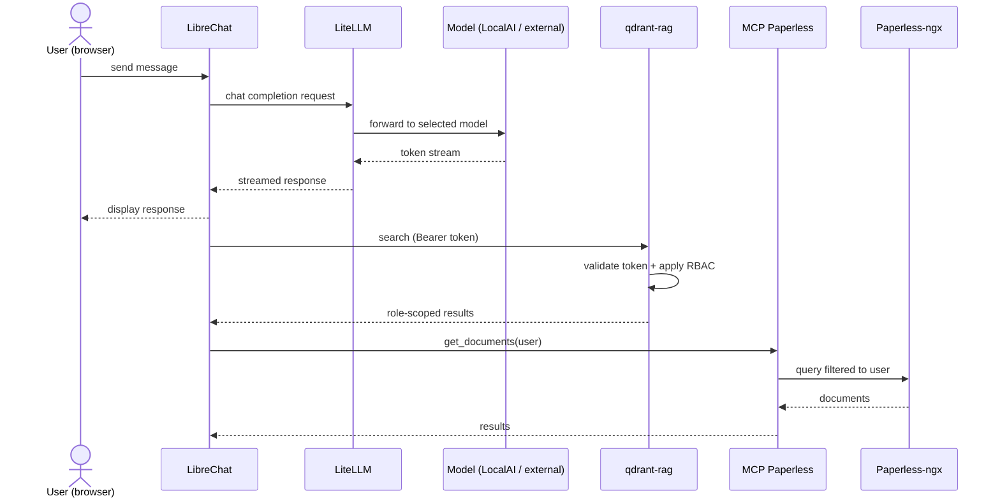

# Architecture

> **Status:** Complete · **Stack version:** 0.7.0

## Overview

papAIa is a self-hosted, OIDC-secured Docker Compose stack that combines AI services (LiteLLM, LibreChat, qdrant-rag, LocalAI) with productivity and infrastructure services (Keycloak, oauth2-proxy, Nginx Proxy Manager, Paperless-ngx, n8n, SearXNG, Homepage).

All services are guarded by a single identity provider (Keycloak by default, or any external OIDC provider). Services with native OIDC support authenticate directly; services without it are protected by an oauth2-proxy forward-auth sidecar. Every user, human or programmatic, obtains a Keycloak token before reaching any service.

Services are organised into optional Compose profiles (`--profile <name>`). A minimal stack runs with `keycloak`, `nginx`, `oauth2-proxy`, `librechat`, and `litellm`. Additional capabilities — local inference, document management, workflow automation, RAG pipelines — are activated by enabling the corresponding profile.

---

## High-level architecture diagram



---

## Service catalog

| Service | Technology | Default port | Auth method | Persistent storage |
|---------|-----------|:------------:|-------------|-------------------|
| **Nginx Proxy Manager** | Node.js + Nginx | 8100 | oauth2-proxy (admin UI) | `nginx-proxy-manager-data`, `nginx-proxy-manager-letsencrypt` |
| **Keycloak** | Java + PostgreSQL 16 | 8110 | — (IdP itself) | `keycloak-postgresql` |
| **oauth2-proxy** | Go | 4180 (internal) | OIDC → Keycloak | — |
| **Technitium DNS** | .NET | 8120 | — | — |
| **LibreChat** | Node.js | 8000 | Native OIDC (PKCE) | `librechat-mongodb`, `librechat-images`, `librechat-uploads`, `librechat-logs` |
| **LibreChat MongoDB** | MongoDB 8.0 | internal | — | `librechat-mongodb` |
| **LibreChat Meilisearch** | Meilisearch v1.35 | internal | — | `librechat-meilisearch` |
| **LibreChat pgvector** | PostgreSQL 15 + pgvector 0.8 | internal | — | `librechat-vectordb` |
| **LibreChat RAG API** | Python (RAG API dev lite) | internal | — | — |
| **LiteLLM** | Python | 8200 | Native OIDC (UI) · API key (programmatic) | `litellm-postgresql` |
| **LiteLLM PostgreSQL** | PostgreSQL 16 | 8210 (internal) | — | `litellm-postgresql` |
| **LiteLLM Prometheus** | Prometheus v3.11 | 8230 | — | `litellm-prometheus` |
| **LocalAI** | Go | 8080 | oauth2-proxy forward-auth | `localai-models` |
| **doc-rag (sync)** | rclone 1.69 | — | WebDAV credentials | — |
| **doc-rag (vectordb)** | Qdrant v1.13 | 6333 | — | `docrag-vectordb` |
| **doc-rag (ingester)** | Python · Docling | — | — | `docrag-state` |
| **doc-rag (MCP API)** | FastMCP | 8700 | — | — |
| **qdrant-rag** | FastMCP + Qdrant v1.13 | 8800 | OIDC + RBAC (Keycloak tokens) | `qdrant_storage` |
| **MCP Paperless** | Node.js | 9520 (internal) | Token forwarding | — |
| **Paperless-ngx** | Python · Django | 8010 | Native OIDC (django-allauth) | `paperless-data`, `paperless-db` |
| **Paperless PostgreSQL** | PostgreSQL 15 | internal | — | `paperless-db` |
| **Paperless Redis** | Redis 7 | internal | — | — |
| **Paperless Tika** | Apache Tika | internal | — | — |
| **Paperless Gotenberg** | Gotenberg | internal | — | — |
| **n8n** | Node.js | 8400 | oauth2-proxy forward-auth | `n8n-data` |
| **n8n PostgreSQL** | PostgreSQL 16 | internal | — | `n8n-db` |
| **Homepage** | Node.js | 8300 | oauth2-proxy forward-auth | — |
| **SearXNG** | Python · Flask | 8500 | oauth2-proxy forward-auth | `searxng_config`, `searxng_data` |

---

## Authentication topology

### Split-URL OIDC pattern

Keycloak must be reachable at two different URLs depending on who is calling:

| Caller | URL variable | Example value | Used for |
|--------|-------------|---------------|---------|
| Browser | `PAPAIA_HOST` / `AUTH_HOST` | `http://papaia.example.com:8110` | OIDC redirect, login page |
| Server-side (token exchange, JWKS fetch) | `OIDC_ISSUER_KC_TOKEN` / `OIDC_ISSUER_KC_CERTS` | `http://keycloak:8080/realms/papaia/...` | Token validation, certificate fetch |

This split is necessary because the Docker-internal DNS name (`keycloak`) is not resolvable from a browser, while the public hostname is not accessible from within the Docker network in most host configurations.

### Native OIDC services

These services integrate directly with Keycloak using the OpenID Connect protocol:

- **LibreChat** — `openid-client` library, PKCE enforced
- **Paperless-ngx** — `django-allauth` OpenID Connect provider
- **LiteLLM** — Generic OIDC for the admin UI; programmatic access uses API keys

### Forward-auth services (oauth2-proxy)

Services without native OIDC support are protected by an oauth2-proxy sidecar. Nginx Proxy Manager uses `auth_request` to call oauth2-proxy before forwarding any request. Services in this group: **Homepage**, **SearXNG**, **LocalAI**, **n8n**, **Nginx PM admin UI**.

### Token forwarding

**MCP Paperless** and **qdrant-rag** receive the caller's Keycloak access token on every request:

- LibreChat injects the token via `{{LIBRECHAT_OPENID_ACCESS_TOKEN}}`
- MCP Paperless reads the `x-librechat-user-email` header to restrict queries to user-owned documents
- qdrant-rag validates the Bearer token against Keycloak JWKS and maps Keycloak roles to per-collection ACL

### Keycloak roles

| Role | Access level |
|------|-------------|
| `admin` | Full stack access; Paperless superuser |
| `user` | Standard access (default for new accounts) |
| `viewer` | Read-only access |

---

## Data flows

### Chat and RAG request flow



### Document ingestion pipeline

```mermaid
flowchart LR
    WD(["WebDAV source\ne.g. Nextcloud"])
    SYNC["rclone sync\n(SYNC_INTERVAL)"]
    VOL["/data/docs/{source}/\nshared volume"]
    ING["Docling ingester\n(SCAN_INTERVAL, mtime check)"]
    CHUNK["heading-aware chunking\nCHUNK_WORDS / CHUNK_OVERLAP"]
    EMBED["LiteLLM\nbatch embedding endpoint"]
    QD[("Qdrant\nper-source collection")]
    API["FastMCP API\nPort 8700"]

    WD -->|"WebDAV credentials"| SYNC
    SYNC --> VOL
    VOL --> ING
    ING --> CHUNK
    CHUNK --> EMBED
    EMBED -->|"upsert vectors"| QD
    QD --> API
```



Supported input formats: PDF, DOCX, Markdown, plain text (via Docling). The ingester tracks processed files in a local SQLite state store (`docrag-state` volume) to avoid re-embedding unchanged documents.

---

## Networking

### Docker network

All services share a single bridge network named `papaia-net` (configurable via `DOCKER_NETWORK`). Services communicate using their Docker Compose service name as hostname (e.g. `http://keycloak:8080`).

### Port binding

External ports are bound using the pattern:

```
HOST_IP:EXT_PORT:INTERNAL_PORT
```

`HOST_IP` defaults to `0.0.0.0` (all interfaces) for development and to a specific IP alias on multi-environment hosts. This allows multiple stack instances to coexist on the same host by assigning each a different IP alias.

### Ingress and TLS

Nginx Proxy Manager is the single ingress point. It handles:

- TLS termination and certificate renewal via Let's Encrypt
- `auth_request` integration with oauth2-proxy for forward-auth routes
- Per-service proxy host entries and custom headers

The NPM admin UI itself is only reachable through oauth2-proxy to prevent unauthenticated access.

### `host.docker.internal` pattern

On Docker Desktop (macOS, Windows), `host.docker.internal` resolves to the host machine from inside containers. This is used as `PAPAIA_HOST` during local development so that the Keycloak OIDC `iss` claim matches the URL the browser uses for redirects. On Linux hosts a static host entry or a LAN IP is used instead.

---

## Persistence

All stateful data is stored in **named Docker volumes**. Bind-mounts are used only for operator-editable configuration files (`PAPAIA_CONFIG_DIR`).

| Volume | Service | Contents |
|--------|---------|----------|
| `keycloak-postgresql` | Keycloak | Realm configuration, users, clients |
| `librechat-mongodb` | LibreChat | Conversations, message history |
| `librechat-meilisearch` | LibreChat | Full-text search index |
| `librechat-vectordb` | LibreChat RAG API | pgvector embeddings |
| `librechat-images` | LibreChat | User-uploaded images |
| `librechat-uploads` | LibreChat | Conversation file attachments |
| `librechat-logs` | LibreChat | Application logs |
| `litellm-postgresql` | LiteLLM | API keys, spend logs, model configs |
| `litellm-prometheus` | Prometheus | Metrics (15-day retention) |
| `localai-models` | LocalAI | Downloaded model weights |
| `qdrant_storage` | qdrant-rag | Role-scoped vector collections |
| `paperless-data` | Paperless-ngx | Documents, thumbnails, index |
| `paperless-db` | Paperless PostgreSQL | Document metadata |
| `n8n-data` | n8n | Workflows, credentials, execution logs |
| `n8n-db` | n8n PostgreSQL | n8n relational state |
| `searxng_config` | SearXNG | Search engine configuration |
| `searxng_data` | SearXNG | Cache |
| `nginx-proxy-manager-data` | Nginx PM | Proxy host configs |
| `nginx-proxy-manager-letsencrypt` | Nginx PM | TLS certificates |

### Backup

The `src/backup-papaia.sh` script serialises all named volumes and the `PAPAIA_CONFIG_DIR` bind-mount into a timestamped archive under `./backups/`. Backups are retained for 14 days locally; off-site replication is left to the host environment.
